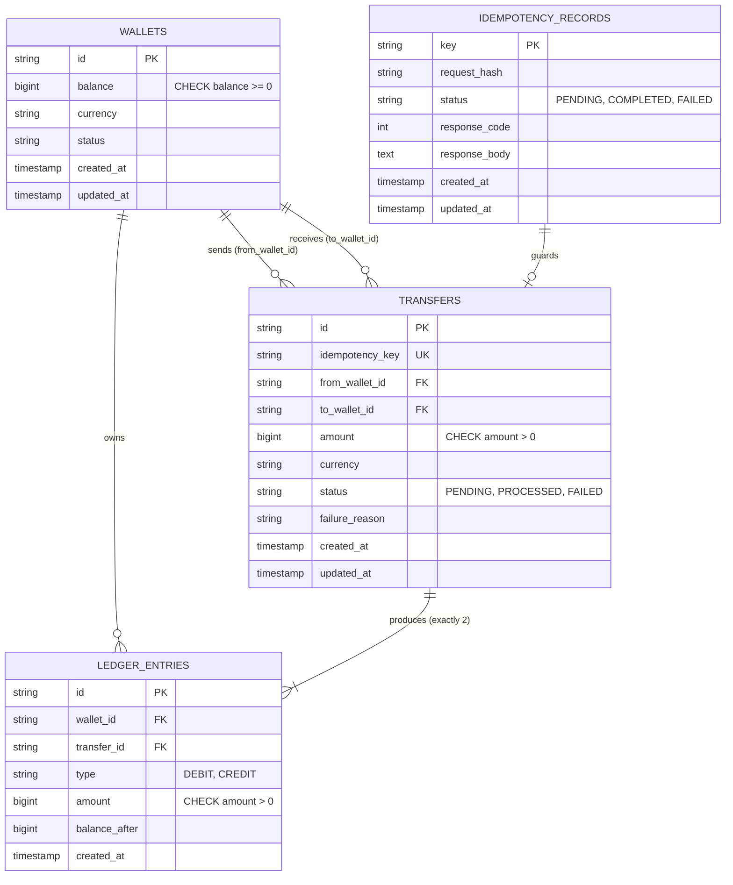
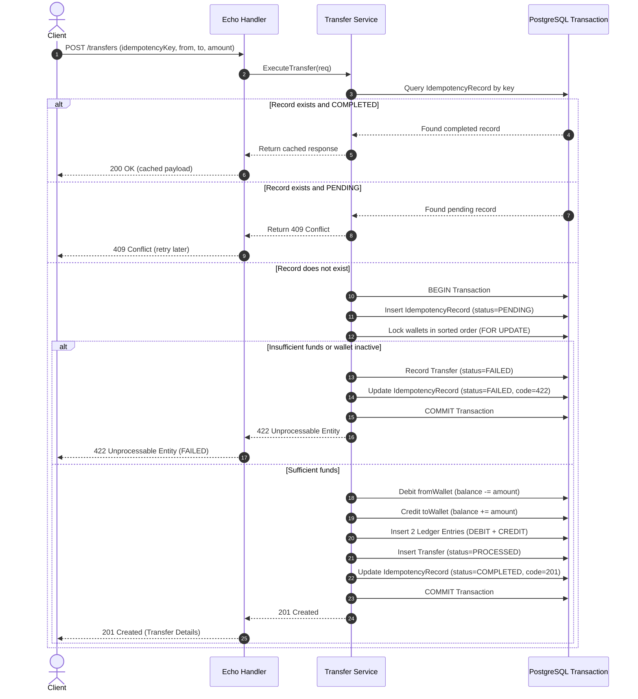

# Wallet Transfer Service — Design Specification & Architectural Blueprint

This document defines the architectural specification, database schema, concurrency model, idempotency guarantees, and testing strategy for the Wallet Transfer Service, adhering to the documentation-first discipline specified in [`ASSIGNMENT.md`](./ASSIGNMENT.md).

---

## 1. Problem Statement & Objectives

The goal is to design and implement a production-grade, highly reliable **Wallet Transfer Service** in **Go** using the **Echo** web framework, **GORM**, and **PostgreSQL**.

The system must satisfy four non-negotiable financial guarantees:
1. **API-Level Exactly-Once Semantics (Idempotency)**: Repeated identical client requests using the same `idempotencyKey` must return the original execution result without duplicate transfers or side effects.
2. **Double-Entry Ledger Integrity**: Every transfer generates matched, immutable `DEBIT` and `CREDIT` ledger records that strictly balance to zero.
3. **Concurrency Safety & Double-Spend Prevention**: Concurrent debits on the same wallet must be strictly serialized, preventing negative balances (`balance >= 0`) and deadlocks.
4. **Safe State Transitions**: The transfer lifecycle (`PENDING` $\to$ `PROCESSED` or `PENDING` $\to$ `FAILED`) must be deterministic, transactionally atomic, and resilient against network failures or crashes.

---

## 2. System Architecture

The service adheres to **Clean Layered Architecture** with strict separation of concerns and dependency inversion:

```
┌────────────────────────────────────────────────────────┐
│                   HTTP / Transport                     │
│                (Echo Router & Handlers)                │
└──────────────────────────┬─────────────────────────────┘
                           │ DTOs / Requests
                           ▼
┌────────────────────────────────────────────────────────┐
│                    Service Layer                       │
│    (Business Orchestration, Idempotency & Workflow)    │
└─────────────┬────────────────────────────┬─────────────┘
              │                            │
              ▼                            ▼
┌───────────────────────────┐ ┌──────────────────────────┐
│       Domain Models       │ │    Repository Layer      │
│  (Entities, State Rules)  │ │ (GORM / SQL Persistence) │
└───────────────────────────┘ └────────────┬─────────────┘
                                           │
                                           ▼
                              ┌──────────────────────────┐
                              │     PostgreSQL / DB      │
                              │ (ACID & Row-Level Locks) │
                              └──────────────────────────┘
```

### Layer Responsibilities
* **`cmd/api`**: Application bootstrapping, configuration loading, database connection pooling, GORM auto-migration, Echo router mounting, graceful shutdown.
* **`internal/config`**: Configuration loading from file (`config.json`, `.env`) with environment variable overrides.
* **`internal/domain`**: Pure business entities (`Wallet`, `Transfer`, `LedgerEntry`, `IdempotencyRecord`), error definitions, state enums, and domain validation.
* **`internal/handler`**: Thin HTTP controllers using the Echo framework. Responsible for HTTP request deserialization, payload validation, calling services, and mapping domain errors to standard HTTP status codes.
* **`internal/service`**: Business orchestration, idempotency checking, transfer workflow execution, transactional boundary orchestration.
* **`internal/repository`**: Database persistence with GORM. Manages queries, transactions (`WithTransaction`), and deterministic row-level locks (`SELECT ... FOR UPDATE`).

---

## 3. Database Schema Design

Amounts are stored as **64-bit integers (`int64`) in the minor currency unit** (e.g., cents for USD, paise for INR) to prevent floating-point rounding errors common in financial calculations.

### Entity Relationship Diagram



### Table Definitions & Constraints
1. **`wallets`**:
   * `id`: Primary key (UUID / string).
   * `balance`: `BIGINT NOT NULL DEFAULT 0`, with `CHECK (balance >= 0)` constraint enforced at database level to guarantee no overdraft under any circumstance.
   * `currency`: `VARCHAR(3) NOT NULL DEFAULT 'USD'`.
   * `status`: `VARCHAR(20) NOT NULL DEFAULT 'ACTIVE'`.
   * `created_at`, `updated_at`: Timestamps.

2. **`transfers`**:
   * `id`: Primary key (UUID / string).
   * `idempotency_key`: `VARCHAR(255) NOT NULL UNIQUE`.
   * `from_wallet_id`: Foreign key referencing `wallets(id)`.
   * `to_wallet_id`: Foreign key referencing `wallets(id)`.
   * `amount`: `BIGINT NOT NULL`, with `CHECK (amount > 0)`.
   * `currency`: `VARCHAR(3) NOT NULL`.
   * `status`: `VARCHAR(20) NOT NULL` (`PENDING`, `PROCESSED`, `FAILED`).
   * `failure_reason`: `TEXT NULL`.
   * `created_at`, `updated_at`: Timestamps.

3. **`ledger_entries`**:
   * `id`: Primary key (UUID / string).
   * `wallet_id`: Foreign key referencing `wallets(id)`.
   * `transfer_id`: Foreign key referencing `transfers(id)`.
   * `type`: `VARCHAR(10) NOT NULL` (`DEBIT` or `CREDIT`).
   * `amount`: `BIGINT NOT NULL`, with `CHECK (amount > 0)`.
   * `balance_after`: `BIGINT NOT NULL` (point-in-time snapshot for auditability).
   * `created_at`: Timestamp.
   * *Rule*: Every transfer must have exactly 1 `DEBIT` and 1 `CREDIT` entry of equal amount.

4. **`idempotency_records`**:
   * `key`: Primary key (`VARCHAR(255)`).
   * `request_hash`: `VARCHAR(64) NOT NULL` (SHA-256 of request payload to detect reuse of key with differing parameters).
   * `status`: `VARCHAR(20) NOT NULL` (`PENDING`, `COMPLETED`, `FAILED`).
   * `response_code`: `INT NULL` (HTTP status code, e.g., 201, 422).
   * `response_body`: `TEXT NULL` (cached JSON response).
   * `created_at`, `updated_at`: Timestamps.

---

## 4. API Contract

### 4.1 Create Transfer
* **Endpoint**: `POST /transfers`
* **Request Headers**:
  * `Content-Type: application/json`
* **Request Body**:
  ```json
  {
    "idempotencyKey": "tx-client-req-001",
    "fromWalletId": "w_alice",
    "toWalletId": "w_bob",
    "amount": 1000
  }
  ```

#### Response Cases:
1. **Success (First Execution)**: `201 Created`
   ```json
   {
     "transferId": "tr_991823",
     "idempotencyKey": "tx-client-req-001",
     "fromWalletId": "w_alice",
     "toWalletId": "w_bob",
     "amount": 1000,
     "currency": "USD",
     "status": "PROCESSED",
     "createdAt": "2026-10-02T16:00:00Z"
   }
   ```
2. **Replay (Idempotent Duplicate)**: `200 OK` (or cached status)
   * Returns exact original response payload, without running transfer logic or creating new ledger rows.
3. **Payload Mismatch (Same key, different payload)**: `422 Unprocessable Entity`
   ```json
   {
     "error": "idempotency key was previously used with a different request payload"
   }
   ```
4. **Concurrent In-Flight Request**: `409 Conflict`
   ```json
   {
     "error": "a transfer with this idempotency key is currently in progress; please retry shortly"
   }
   ```
5. **Insufficient Balance**: `422 Unprocessable Entity`
   ```json
   {
     "error": "insufficient balance in source wallet",
     "transferId": "tr_991824",
     "status": "FAILED"
   }
   ```
6. **Validation Failure (e.g. self-transfer, non-positive amount)**: `400 Bad Request`

### 4.2 Helper & Inspection Endpoints
* **`GET /transfers/:id`**: Fetch transfer status and details.
* **`GET /transfers/:id/ledger`**: Fetch double-entry ledger rows for the transfer.
* **`GET /wallets/:id`**: Fetch wallet details.
* **`GET /wallets/:id/balance`**: Fetch stored balance and verify matching ledger sum.
* **`POST /wallets`**: Create wallet with initial balance (for testing and operational setup).
* **`GET /health`**: Health check probe (`status: ok`).

---

## 5. Concurrency Control & Deadlock Prevention

### The Deadlock Risk
In a concurrent system, if User A transfers to User B while User B simultaneously transfers to User A:
* Thread 1 locks Wallet A, then requests lock on Wallet B.
* Thread 2 locks Wallet B, then requests lock on Wallet A.
* **Result**: Circular wait $\to$ PostgreSQL deadlock exception (`40P01 deadlocks detected`).

### The Solution: Deterministic Lock Ordering
To guarantee freedom from circular wait deadlocks, our system acquires pessimistic row locks (`SELECT ... FOR UPDATE` via GORM `clause.Locking{Strength: "UPDATE"}`) on wallets in **lexicographical order of their IDs**:

```go
func (r *walletRepo) GetPairForUpdate(ctx context.Context, tx *gorm.DB, idA, idB string) (*Wallet, *Wallet, error) {
    firstID, secondID := idA, idB
    if idA > idB {
        firstID, secondID = idB, idA
    }

    // 1. Lock first wallet
    w1, err := r.getForUpdate(ctx, tx, firstID)
    if err != nil { return nil, nil, err }

    // 2. Lock second wallet
    w2, err := r.getForUpdate(ctx, tx, secondID)
    if err != nil { return nil, nil, err }

    if idA == firstID {
        return w1, w2, nil
    }
    return w2, w1, nil
}
```
Because all concurrent transactions acquire row locks in the exact same order ($id_1 < id_2$), circular dependencies are mathematically impossible.

---

## 6. Transactional Workflow & Idempotency Lifecycle

Every transfer request executes through the following transactional sequence:



---

## 7. Testing Strategy

1. **Unit Testing**:
   * Request validation (negative amount, identical from/to wallet IDs, missing idempotency key).
   * Request hashing and payload match checking.
   * Lock ordering helper logic.

2. **Integration & Behavior Testing**:
   * **Happy Path**: Successful transfer creates 2 ledger entries and updates balances accurately.
   * **Idempotency Replay**: Sending the same request twice returns identical response and produces exactly 2 ledger entries (not 4).
   * **Idempotency Payload Tampering**: Sending the same key with different amount/recipient is rejected with 422.
   * **Insufficient Funds**: Source wallet balance untouched; transfer recorded as `FAILED`.
   * **Non-existent Wallet**: Handled gracefully without partial writes.

3. **High-Concurrency Testing**:
   * **No Double Spend Test**: Spawn 20 concurrent goroutines attempting to debit \$50 each from a wallet with only \$100. Exactly 2 transfers must succeed, 18 must fail, wallet balance must end at \$0, and ledger must balance.
   * **Deadlock Freedom Test**: Spawn 50 concurrent goroutines with simultaneous alternating transfers (Wallet A $\to$ Wallet B and Wallet B $\to$ Wallet A). All must complete without deadlock.
